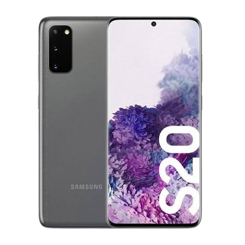
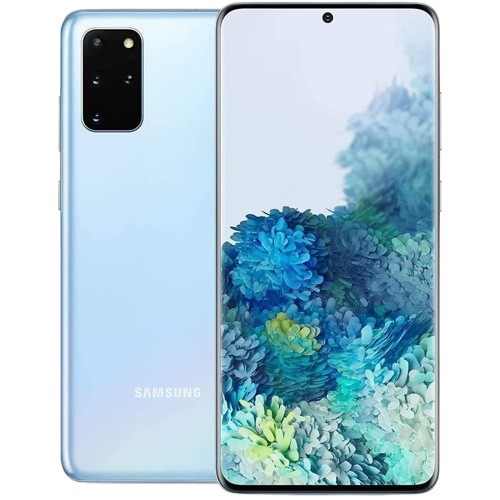
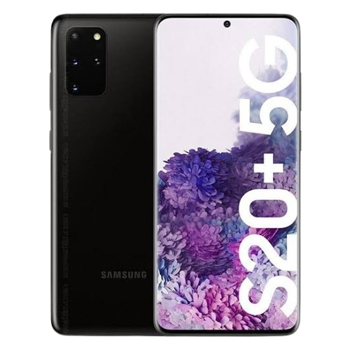
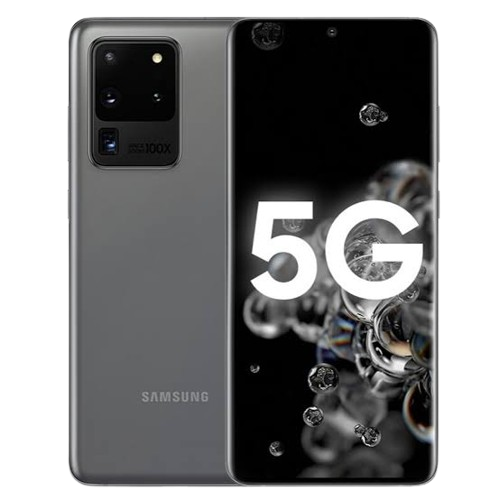
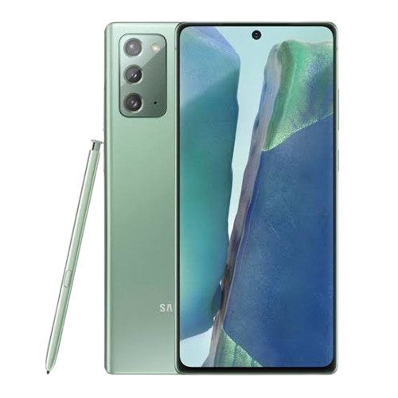
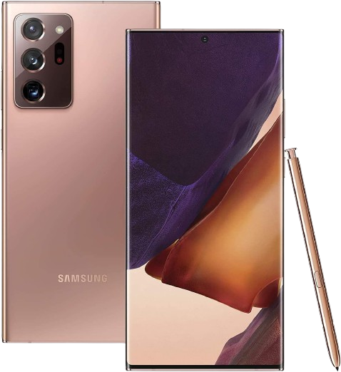
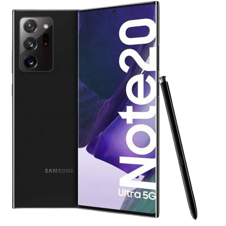

# Family Samsung Galaxy S20 

Basic   | Specification List
-------:|:-------------------------
CPU     | Octa-core 2x2.73 GHz Mongoose M5 & 2x2.50 GHz Cortex-A76 & 4x2.0 GHz Cortex-A55
Chipset | Samsung Exynos 990/9830
GPU     | ARM Mali-G77 MP11
Memory  | 6/8/12/16 GB
Shipped Android Version | 10
Storage | 128GB / 256GB / 512GB (UFS 3.0)
MicroSD | Up to 256 GB
Battery | Li-Ion 4000/4500/5000 mAh
Dimensions | 159,8 mm x 74,5 mm x 8,4 mm
Display | 2400 x 1080 pixel - 1440 x 3200 pixel
Rear Camera  | 12 MP, f/1.8, 26mm (wide), 8 MP, f/2.4, 76mm (telephoto), 12 MP, f/2.2, 13mm, 120˚ (ultrawide), LED flash, auto-HDR, panorama - 108 MP, f/1.8, 26mm (wide), 1/1.33", 0.8µm, PDAF, OIS 48 MP, f/3.5, 103mm (periscope telephoto), 1/2.0", 0.8µm, PDAF, OIS, 4x optical zoom, 10x hybrid zoom 12 MP, f/2.2, 13mm, 120˚ (ultrawide), 1/2.55" 1.4µm, Super Steady video 0.3 MP, TOF 3D, f/1.0, (depth)
Front Camera | 10/32/40 MP, f/2.2, 26mm, HDR
Release Date | 06 March - 02 October 2020
________

<b><strong>Samsung Galaxy S20</strong></b>

**Maintainer: Unknown**  
**codename: x1slte**  
**Testers: None**

| ✅    | **Working**     |
|-------|-----------------|
| ⚠️    | **Problematic** |
| ❌    | **Not Working** |
| ❔    | **Unknown**     |

<table>
<tr><th>Ubuntu Touch</th></tr>
<tr><td>

| Feature                    | Description                                                    | State |
|:---------------------------|:---------------------------------------------------------------|:-----:|
| Recovery Ubports           |                                                                |  ❔   |
| Side Buttons               |                                                                |  ❔   |
| Proximity Sensor           |                                                                |  ❔   |
| Ambient Light Sensor       |                                                                |  ❔   |
| Light Sensor               |                                                                |  ❔   |
| Accelerometer Sensor       |                                                                |  ❔   |
| Compass Sensor             |                                                                |  ❔   |
| Gyroscope Sensor           |                                                                |  ❔   |
| Rotation                   |                                                                |  ❔   |
| Fingerprint Sensor         |                                                                |  ❔   |
| Temperature Sensor         |                                                                |  ❔   |
| Battery                    |                                                                |  ❔   |
| USB Host Mode              |                                                                |  ❔   |
| USB Device Mode            |                                                                |  ❔   |
| USB Power Delivery         |                                                                |  ❔   |
| Charging                   |                                                                |  ❔   |
| WLAN                       | Usually sometimes does not detect.                             |  ❔   |
| CPU                        |                                                                |  ❔   |
| Touchscreen                |                                                                |  ❔   |
| Audio (Speakers/Microphone)|                                                                |  ❔   |
| Bluetooth                  |                                                                |  ❔   |
| GPS                        |                                                                |  ❔   |
| GPU                        |                                                                |  ❔   |
| Camera (Photos/QR/Video)   | Can't take photos/videos and QR reading works                  |  ❔   |
| Mobile Data                |                                                                |  ❔   |
| Hotspot                    |                                                                |  ❔   |
| Airplane Mode              |                                                                |  ❔   |
| Display                    |                                                                |  ❔   |
| Vibration                  |                                                                |  ❔   |
| Waydroid                   |                                                                |  ❔   |
| Double Tap to Wake         |                                                                |  ❔   |
| SSH                        | You have to do it manually                                     |  ❔   |
| Virtualization             |                                                                |  ❔   |
| Automatic brightness       |                                                                |  ❔   |

</td></tr> </table>

  

<b><strong>Samsung Galaxy S20 5G</strong></b>

**Maintainer: Unknown**  
**codename: x1s**  
**Testers: None**

| ✅    | **Working**     |
|-------|-----------------|
| ⚠️    | **Problematic** |
| ❌    | **Not Working** |
| ❔    | **Unknown**     |

<table>
<tr><th>Ubuntu Touch</th></tr>
<tr><td>

| Feature                    | Description                                                    | State |
|:---------------------------|:---------------------------------------------------------------|:-----:|
| Recovery Ubports           |                                                                |  ❔   |
| Side Buttons               |                                                                |  ❔   |
| Proximity Sensor           |                                                                |  ❔   |
| Ambient Light Sensor       |                                                                |  ❔   |
| Light Sensor               |                                                                |  ❔   |
| Accelerometer Sensor       |                                                                |  ❔   |
| Compass Sensor             |                                                                |  ❔   |
| Gyroscope Sensor           |                                                                |  ❔   |
| Rotation                   |                                                                |  ❔   |
| Fingerprint Sensor         |                                                                |  ❔   |
| Temperature Sensor         |                                                                |  ❔   |
| Battery                    |                                                                |  ❔   |
| USB Host Mode              |                                                                |  ❔   |
| USB Device Mode            |                                                                |  ❔   |
| USB Power Delivery         |                                                                |  ❔   |
| Charging                   |                                                                |  ❔   |
| WLAN                       | Usually sometimes does not detect.                             |  ❔   |
| CPU                        |                                                                |  ❔   |
| Touchscreen                |                                                                |  ❔   |                  
| Audio (Speakers/Microphone)|                                                                |  ❔   |
| Bluetooth                  |                                                                |  ❔   |
| GPS                        |                                                                |  ❔   |
| GPU                        |                                                                |  ❔   |
| Camera (Photos/QR/Video)   | Can't take photos/videos and QR reading works                  |  ❔   |
| Mobile Data                |                                                                |  ❔   |
| Hotspot                    |                                                                |  ❔   |
| Airplane Mode              |                                                                |  ❔   |
| Display                    |                                                                |  ❔   |
| Vibration                  |                                                                |  ❔   |
| Waydroid                   |                                                                |  ❔   |
| Double Tap to Wake         |                                                                |  ❔   |
| SSH                        | You have to do it manually                                     |  ❔   |
| Virtualization             |                                                                |  ❔   |
| Automatic brightness       |                                                                |  ❔   |

</td></tr> </table>

  

<b><strong>Samsung Galaxy S20 FE</strong></b>

**Maintainer: [Sota4Ever](https://github.com/Sota4Ever)**  
**Codename: r8s**  
**Testers: [Sota4Ever](https://github.com/Sota4Ever)**

| ✅    | **Working**     |
|-------|-----------------|
| ⚠️    | **Problematic** |
| ❌    | **Not Working** |
| ❔    | **Unknown**     |

<table>
<tr><th>Ubuntu Touch</th></tr>
<tr><td>

| Feature                    | Description                                                    | State |
|:---------------------------|:---------------------------------------------------------------|:-----:|
| Recovery Ubports           |                                                                |  ❔   |
| Side Buttons               |                                                                |  ✅   |
| Proximity Sensor           |                                                                |  ❌   |
| Ambient Light Sensor       |                                                                |  ✅   |
| Light Sensor               |                                                                |  ✅   |
| Accelerometer Sensor       |                                                                |  ✅   |
| Compass Sensor             |                                                                |  ✅   |
| Gyroscope Sensor           |                                                                |  ✅   |
| Rotation                   |                                                                |  ✅   |
| Fingerprint Sensor         |                                                                |  ❌   |
| Temperature Sensor         |                                                                |  ❌   |
| Battery                    |                                                                |  ✅   |
| USB Host Mode              |                                                                |  ✅   |
| USB Device Mode            |                                                                |  ✅   |
| USB Power Delivery         |                                                                |  ✅   |
| Charging                   |                                                                |  ✅   |
| WLAN                       | Usually sometimes does not detect.                             |  ⚠️    |
| CPU                        |                                                                |  ✅   |
| Touchscreen                |                                                                |  ✅   |
| Audio (Speakers/Microphone)|                                                                |  ✅   |
| Bluetooth                  |                                                                |  ✅   |
| GPS                        |                                                                |  ✅   |
| GPU                        |                                                                |  ✅   |
| Camera (Photos/QR/Video)   | Can't take photos/videos and QR reading works                  |  ⚠️    |
| Mobile Data                |                                                                |  ✅   |
| Hotspot                    |                                                                |  ✅   |
| Airplane Mode              |                                                                |  ✅   |
| Display                    |                                                                |  ✅   |
| Vibration                  |                                                                |  ✅   |
| Waydroid                   |                                                                |  ❔   |
| Double Tap to Wake         |                                                                |  ❌   |
| SSH                        | You have to do it manually                                     |  ✅   |
| Virtualization             |                                                                |  ❔   |
| Automatic brightness       |                                                                |  ✅   |

</td></tr> </table>

 

<b><strong>Samsung Galaxy S20+</strong></b>

**Maintainer: Unknown**  
**codename: y2slte**  
**Testers: None**

| ✅    | **Working**     |
|-------|-----------------|
| ⚠️    | **Problematic** |
| ❌    | **Not Working** |
| ❔    | **Unknown**     |

<table>
<tr><th>Ubuntu Touch</th></tr>
<tr><td>

| Feature                    | Description                                                    | State |
|:---------------------------|:---------------------------------------------------------------|:-----:|
| Recovery Ubports           |                                                                |  ❔   |
| Side Buttons               |                                                                |  ❔   |
| Proximity Sensor           |                                                                |  ❔   |
| Ambient Light Sensor       |                                                                |  ❔   |
| Light Sensor               |                                                                |  ❔   |
| Accelerometer Sensor       |                                                                |  ❔   |
| Compass Sensor             |                                                                |  ❔   |
| Gyroscope Sensor           |                                                                |  ❔   |
| Rotation                   |                                                                |  ❔   |
| Fingerprint Sensor         |                                                                |  ❔   |
| Temperature Sensor         |                                                                |  ❔   |
| Battery                    |                                                                |  ❔   |
| USB Host Mode              |                                                                |  ❔   |
| USB Device Mode            |                                                                |  ❔   |
| USB Power Delivery         |                                                                |  ❔   |
| Charging                   |                                                                |  ❔   |
| WLAN                       | Usually sometimes does not detect.                             |  ❔   |
| CPU                        |                                                                |  ❔   |
| Touchscreen                |                                                                |  ❔   |                  
| Bluetooth                  |                                                                |  ❔   |
| GPS                        |                                                                |  ❔   |
| GPU                        |                                                                |  ❔   |
| Camera (Photos/QR/Video)   | Can't take photos/videos and QR reading works                  |  ❔   |
| Mobile Data                |                                                                |  ❔   |
| Hotspot                    |                                                                |  ❔   |
| Airplane Mode              |                                                                |  ❔   |
| Display                    |                                                                |  ❔   |
| Vibration                  |                                                                |  ❔   |
| Waydroid                   |                                                                |  ❔   |
| Double Tap to Wake         |                                                                |  ❔   |
| SSH                        | You have to do it manually                                     |  ❔   |
| Virtualization             |                                                                |  ❔   |
| Automatic brightness       |                                                                |  ❔   |

</td></tr> </table>

  

<b><strong>Samsung Galaxy S20+ 5G</strong></b>

**Maintainer: Unknown**  
**codename: y2s**  
**Testers: None**

| ✅    | **Working**     |
|-------|-----------------|
| ⚠️    | **Problematic** |
| ❌    | **Not Working** |
| ❔    | **Unknown**     |

<table>
<tr><th>Ubuntu Touch</th></tr>
<tr><td>

| Feature                    | Description                                                    | State |
|:---------------------------|:---------------------------------------------------------------|:-----:|
| Recovery Ubports           |                                                                |  ❔   |
| Side Buttons               |                                                                |  ❔   |
| Proximity Sensor           |                                                                |  ❔   |
| Ambient Light Sensor       |                                                                |  ❔   |
| Light Sensor               |                                                                |  ❔   |
| Accelerometer Sensor       |                                                                |  ❔   |
| Compass Sensor             |                                                                |  ❔   |
| Gyroscope Sensor           |                                                                |  ❔   |
| Rotation                   |                                                                |  ❔   |
| Fingerprint Sensor         |                                                                |  ❔   |
| Temperature Sensor         |                                                                |  ❔   |
| Battery                    |                                                                |  ❔   |
| USB Host Mode              |                                                                |  ❔   |
| USB Device Mode            |                                                                |  ❔   |
| USB Power Delivery         |                                                                |  ❔   |
| Charging                   |                                                                |  ❔   |
| WLAN                       | Usually sometimes does not detect.                             |  ❔   |
| CPU                        |                                                                |  ❔   |
| Touchscreen                |                                                                |  ❔   |
| Bluetooth                  |                                                                |  ❔   |
| GPS                        |                                                                |  ❔   |
| GPU                        |                                                                |  ❔   |
| Camera (Photos/QR/Video)   | Can't take photos/videos and QR reading works                  |  ❔   |
| Mobile Data                |                                                                |  ❔   |
| Hotspot                    |                                                                |  ❔   |
| Airplane Mode              |                                                                |  ❔   |
| Display                    |                                                                |  ❔   |
| Vibration                  |                                                                |  ❔   |
| Waydroid                   |                                                                |  ❔   |
| Double Tap to Wake         |                                                                |  ❔   |
| SSH                        | You have to do it manually                                     |  ❔   |
| Virtualization             |                                                                |  ❔   |
| Automatic brightness       |                                                                |  ❔   |

</td></tr> </table>

  

<b><strong>Samsung Galaxy S20 Ultra 5G</strong></b>

**Maintainer: Unknown**  
**codename: z3s**  
**Testers: None**

| ✅    | **Working**     |
|-------|-----------------|
| ⚠️    | **Problematic** |
| ❌    | **Not Working** |
| ❔    | **Unknown**     |

<table>
<tr><th>Ubuntu Touch</th></tr>
<tr><td>

| Feature                    | Description                                                    | State |
|:---------------------------|:---------------------------------------------------------------|:-----:|
| Recovery Ubports           |                                                                |  ❔   |
| Side Buttons               |                                                                |  ❔   |
| Proximity Sensor           |                                                                |  ❔   |
| Ambient Light Sensor       |                                                                |  ❔   |
| Light Sensor               |                                                                |  ❔   |
| Accelerometer Sensor       |                                                                |  ❔   |
| Compass Sensor             |                                                                |  ❔   |
| Gyroscope Sensor           |                                                                |  ❔   |
| Rotation                   |                                                                |  ❔   |
| Fingerprint Sensor         |                                                                |  ❔   |
| Temperature Sensor         |                                                                |  ❔   |
| Battery                    |                                                                |  ❔   |
| USB Host Mode              |                                                                |  ❔   |
| USB Device Mode            |                                                                |  ❔   |
| USB Power Delivery         |                                                                |  ❔   |
| Charging                   |                                                                |  ❔   |
| WLAN                       | Usually sometimes does not detect.                             |  ❔   |
| CPU                        |                                                                |  ❔   |
| Touchscreen                |                                                                |  ❔   |                  
| Bluetooth                  |                                                                |  ❔   |
| GPS                        |                                                                |  ❔   |
| GPU                        |                                                                |  ❔   |
| Camera (Photos/QR/Video)   | Can't take photos/videos and QR reading works                  |  ❔   |
| Mobile Data                |                                                                |  ❔   |
| Hotspot                    |                                                                |  ❔   |
| Airplane Mode              |                                                                |  ❔   |
| Display                    |                                                                |  ❔   |
| Vibration                  |                                                                |  ❔   |
| Waydroid                   |                                                                |  ❔   |
| Double Tap to Wake         |                                                                |  ❔   |
| SSH                        | You have to do it manually                                     |  ❔   |
| Virtualization             |                                                                |  ❔   |
| Automatic brightness       |                                                                |  ❔   |

</td></tr> </table>

  

# Family Samsung Note 20

Basic   | Specification List
-------:|:-------------------------
CPU     | Octa-core 2x2.73 GHz Mongoose M5 & 2x2.50 GHz Cortex-A76 & 4x2.0 GHz Cortex-A55
Chipset | Samsung Exynos 990/9830
GPU     | ARM Mali-G77 MP11
Memory  | 8/12 GB
Shipped Android Version | 10
Storage | 128GB / 256GB / 512GB (UFS 3.0)
MicroSD | Up to 256 GB
Battery | Li-Ion 4300/4500 mAh
Dimensions | 161.6 x 75.2 x 8.3 mm  - 164.8 x 77.2 x 8.1 mm
Display | 1080 x 2400 pixels - 1440 x 3088 pixels
Rear Camera  | 12 MP, f/1.8, 26mm (wide), 1/1.76", 1.8µm, Dual Pixel PDAF, OIS 64 MP, f/2.0, 27mm (telephoto), 1/1.72", 0.8µm, PDAF, OIS, 3x hybrid zoom 12 MP, f/2.2, 120˚, 13mm (ultrawide), 1/2.55", 1.4µm - 108 MP, f/1.8, 26mm (wide), 1/1.33", 0.8µm, PDAF, Laser AF, OIS 12 MP, f/3.0, 120mm (periscope telephoto), 1.0µm, PDAF, OIS, 5x optical zoom, 50x hybrid zoom 12 MP, f/2.2, 120˚, 13mm (ultrawide), 1/2.55", 1.4µm
Front Camera | 10 MP, f/2.2, 26mm (wide), 1/3.2", 1.22µm, Dual Pixel PDAF
Release Date | 21 August 2020
________

<b><strong>Samsung Galaxy Note20</strong></b>

**Maintainer: Unknown**  
**codename: c1slte**  
**Testers: None**

| ✅    | **Working**     |
|-------|-----------------|
| ⚠️    | **Problematic** |
| ❌    | **Not Working** |
| ❔    | **Unknown**     |

<table>
<tr><th>Ubuntu Touch</th></tr>
<tr><td>

| Feature                    | Description                                                    | State |
|:---------------------------|:---------------------------------------------------------------|:-----:|
| Recovery Ubports           |                                                                |  ❔   |
| Side Buttons               |                                                                |  ❔   |
| Proximity Sensor           |                                                                |  ❔   |
| Ambient Light Sensor       |                                                                |  ❔   |
| Light Sensor               |                                                                |  ❔   |
| Accelerometer Sensor       |                                                                |  ❔   |
| Compass Sensor             |                                                                |  ❔   |
| Gyroscope Sensor           |                                                                |  ❔   |
| Rotation                   |                                                                |  ❔   |
| Fingerprint Sensor         |                                                                |  ❔   |
| Temperature Sensor         |                                                                |  ❔   |
| Battery                    |                                                                |  ❔   |
| USB Host Mode              |                                                                |  ❔   |
| USB Device Mode            |                                                                |  ❔   |
| USB Power Delivery         |                                                                |  ❔   |
| Charging                   |                                                                |  ❔   |
| WLAN                       | Usually sometimes does not detect.                             |  ❔   |
| CPU                        |                                                                |  ❔   |
| Touchscreen                |                                                                |  ❔   |                  
| Bluetooth                  |                                                                |  ❔   |
| GPS                        |                                                                |  ❔   |
| GPU                        |                                                                |  ❔   |
| Camera (Photos/QR/Video)   | Can't take photos/videos and QR reading works                  |  ❔   |
| Mobile Data                |                                                                |  ❔   |
| Hotspot                    |                                                                |  ❔   |
| Airplane Mode              |                                                                |  ❔   |
| Display                    |                                                                |  ❔   |
| Vibration                  |                                                                |  ❔   |
| Waydroid                   |                                                                |  ❔   |
| Double Tap to Wake         |                                                                |  ❔   |
| SSH                        | You have to do it manually                                     |  ❔   |
| Virtualization             |                                                                |  ❔   |
| Automatic brightness       |                                                                |  ❔   |

</td></tr> </table>

  

<b><strong>Samsung Galaxy Note20 5G</strong></b>

**Maintainer: Unknown**  
**codename: c1s**  
**Testers: None**

| ✅    | **Working**     |
|-------|-----------------|
| ⚠️    | **Problematic** |
| ❌    | **Not Working** |
| ❔    | **Unknown**     |

<table>
<tr><th>Ubuntu Touch</th></tr>
<tr><td>

| Feature                    | Description                                                    | State |
|:---------------------------|:---------------------------------------------------------------|:-----:|
| Recovery Ubports           |                                                                |  ❔   |
| Side Buttons               |                                                                |  ❔   |
| Proximity Sensor           |                                                                |  ❔   |
| Ambient Light Sensor       |                                                                |  ❔   |
| Light Sensor               |                                                                |  ❔   |
| Accelerometer Sensor       |                                                                |  ❔   |
| Compass Sensor             |                                                                |  ❔   |
| Gyroscope Sensor           |                                                                |  ❔   |
| Rotation                   |                                                                |  ❔   |
| Fingerprint Sensor         |                                                                |  ❔   |
| Temperature Sensor         |                                                                |  ❔   |
| Battery                    |                                                                |  ❔   |
| USB Host Mode              |                                                                |  ❔   |
| USB Device Mode            |                                                                |  ❔   |
| USB Power Delivery         |                                                                |  ❔   |
| Charging                   |                                                                |  ❔   |
| WLAN                       | Usually sometimes does not detect.                             |  ❔   |
| CPU                        |                                                                |  ❔   |
| Touchscreen                |                                                                |  ❔   |                  
| Bluetooth                  |                                                                |  ❔   |
| GPS                        |                                                                |  ❔   |
| GPU                        |                                                                |  ❔   |
| Camera (Photos/QR/Video)   | Can't take photos/videos and QR reading works                  |  ❔   |
| Mobile Data                |                                                                |  ❔   |
| Hotspot                    |                                                                |  ❔   |
| Airplane Mode              |                                                                |  ❔   |
| Display                    |                                                                |  ❔   |
| Vibration                  |                                                                |  ❔   |
| Waydroid                   |                                                                |  ❔   |
| Double Tap to Wake         |                                                                |  ❔   |
| SSH                        | You have to do it manually                                     |  ❔   |
| Virtualization             |                                                                |  ❔   |
| Automatic brightness       |                                                                |  ❔   |

</td></tr> </table>

  

<b><strong>Samsung Galaxy Note20 Ultra</strong></b>

**Maintainer: Unknown**  
**codename: c2slte**  
**Testers: None**

| ✅    | **Working**     |
|-------|-----------------|
| ⚠️    | **Problematic** |
| ❌    | **Not Working** |
| ❔    | **Unknown**     |

<table>
<tr><th>Ubuntu Touch</th></tr>
<tr><td>

| Feature                    | Description                                                    | State |
|:---------------------------|:---------------------------------------------------------------|:-----:|
| Recovery Ubports           |                                                                |  ❔   |
| Side Buttons               |                                                                |  ❔   |
| Proximity Sensor           |                                                                |  ❔   |
| Ambient Light Sensor       |                                                                |  ❔   |
| Light Sensor               |                                                                |  ❔   |
| Accelerometer Sensor       |                                                                |  ❔   |
| Compass Sensor             |                                                                |  ❔   |
| Gyroscope Sensor           |                                                                |  ❔   |
| Rotation                   |                                                                |  ❔   |
| Fingerprint Sensor         |                                                                |  ❔   |
| Temperature Sensor         |                                                                |  ❔   |
| Battery                    |                                                                |  ❔   |
| USB Host Mode              |                                                                |  ❔   |
| USB Device Mode            |                                                                |  ❔   |
| USB Power Delivery         |                                                                |  ❔   |
| Charging                   |                                                                |  ❔   |
| WLAN                       | Usually sometimes does not detect.                             |  ❔   |
| CPU                        |                                                                |  ❔   |
| Touchscreen                |                                                                |  ❔   |                  
| Bluetooth                  |                                                                |  ❔   |
| GPS                        |                                                                |  ❔   |
| GPU                        |                                                                |  ❔   |
| Camera (Photos/QR/Video)   | Can't take photos/videos and QR reading works                  |  ❔   |
| Mobile Data                |                                                                |  ❔   |
| Hotspot                    |                                                                |  ❔   |
| Airplane Mode              |                                                                |  ❔   |
| Display                    |                                                                |  ❔   |
| Vibration                  |                                                                |  ❔   |
| Waydroid                   |                                                                |  ❔   |
| Double Tap to Wake         |                                                                |  ❔   |
| SSH                        | You have to do it manually                                     |  ❔   |
| Virtualization             |                                                                |  ❔   |
| Automatic brightness       |                                                                |  ❔   |

</td></tr> </table>

  

<b><strong>Samsung Galaxy Note20 Ultra 5G</strong></b>

**Maintainer: Unknown**  
**codename: c2s**  
**Testers: None**

| ✅    | **Working**     |
|-------|-----------------|
| ⚠️    | **Problematic** |
| ❌    | **Not Working** |
| ❔    | **Unknown**     |

<table>
<tr><th>Ubuntu Touch</th></tr>
<tr><td>

| Feature                    | Description                                                    | State |
|:---------------------------|:---------------------------------------------------------------|:-----:|
| Recovery Ubports           |                                                                |  ❔   |
| Side Buttons               |                                                                |  ❔   |
| Proximity Sensor           |                                                                |  ❔   |
| Ambient Light Sensor       |                                                                |  ❔   |
| Light Sensor               |                                                                |  ❔   |
| Accelerometer Sensor       |                                                                |  ❔   |
| Compass Sensor             |                                                                |  ❔   |
| Gyroscope Sensor           |                                                                |  ❔   |
| Rotation                   |                                                                |  ❔   |
| Fingerprint Sensor         |                                                                |  ❔   |
| Temperature Sensor         |                                                                |  ❔   |
| Battery                    |                                                                |  ❔   |
| USB Host Mode              |                                                                |  ❔   |
| USB Device Mode            |                                                                |  ❔   |
| USB Power Delivery         |                                                                |  ❔   |
| Charging                   |                                                                |  ❔   |
| WLAN                       | Usually sometimes does not detect.                             |  ❔   |
| CPU                        |                                                                |  ❔   |
| Touchscreen                |                                                                |  ❔   |                  
| Bluetooth                  |                                                                |  ❔   |
| GPS                        |                                                                |  ❔   |
| GPU                        |                                                                |  ❔   |
| Camera (Photos/QR/Video)   | Can't take photos/videos and QR reading works                  |  ❔   |
| Mobile Data                |                                                                |  ❔   |
| Hotspot                    |                                                                |  ❔   |
| Airplane Mode              |                                                                |  ❔   |
| Display                    |                                                                |  ❔   |
| Vibration                  |                                                                |  ❔   |
| Waydroid                   |                                                                |  ❔   |
| Double Tap to Wake         |                                                                |  ❔   |
| SSH                        | You have to do it manually                                     |  ❔   |
| Virtualization             |                                                                |  ❔   |
| Automatic brightness       |                                                                |  ❔   |

</td></tr> </table>

  

